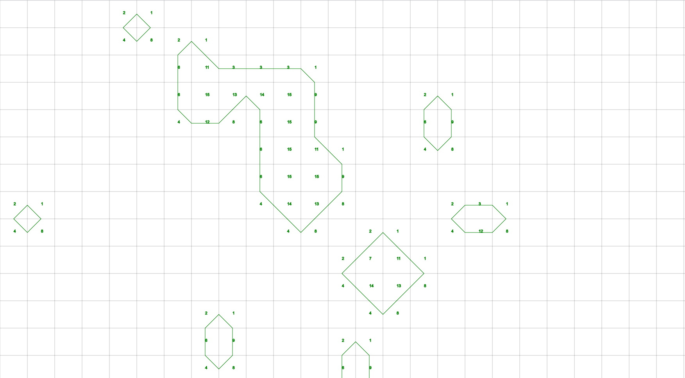
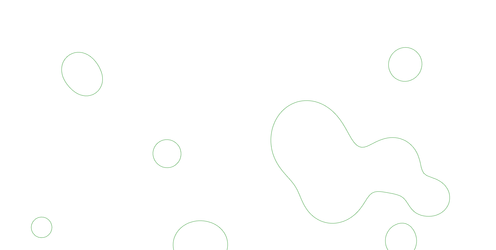

# Metaballs

In this project, I wanted to make my implementation of Metaballs in TypeScript.
You can see it for yourself [here](https://metaballs.pkozak.org/).

## What are those metaballs?

A metaball is an isoline[^1] shape that has an organic cell-like ability to merge with other metaballs.

## How does it work?

First, we calculate the value for every cell using a function.
The function takes contributions from each circle.
The cells which value is greater than 1 are inside the metaball.

We could change the colour of every pixel if its value is greater than one and call it a day.
But if we do some quick maths and calculate how many pixels there are in Full HD resolution - 2 073 600 pixels.
We would have to check every pixel in a single frame,
and we would have to render 60 frames per second which equals **_124 416 000_** operations per second.
Yeah, that's a _little_ too much, even for today's processors.
So how can we optimize it?

### Marching squares

Enter the marching squares algorithm. What it does is - it takes the calculated value of every corner of our cell and
assigns it a state. There are 16 possible states (2⁴). Based on a state, we draw a line for every cell.

We get some fast but very blocky metaballs.
Of course, we can pump up the resolution, but that would result in only a
little less blocky metaballs.

### Linear interpolation

At the moment, for every state, we have a hardcoded line.
And if that line doesn't start or end on one of the corners,
it does that from the middle of the cell.
If there only was a way to calculate those positions on the go.
The linear interpolation algorithm comes to the rescue!
By adding the lerp output to the starting/ending points of the lines.
And decreasing the cell size to 10px.
We get this!

# Sources

- [Paper on metaballs by Jamie Wong](http://jamie-wong.com/2014/08/19/metaballs-and-marching-squares/)
- [linear interpolation algorithm](https://en.wikipedia.org/wiki/Linear_interpolation)

[^1]: Isoline - a curve of a mathematical function.
